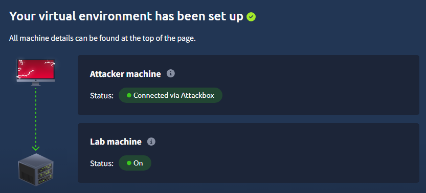
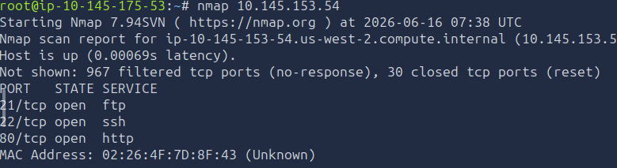

Bounty Hacker: https://tryhackme.com/room/cowboyhacker

First questions ask us to deploy both the attack machine and lab machine before starting the lab. In this lab I will be using the attackbox provided by tryhackme.

Second questions has us find open ports on the machine. Network ports are endpoints for software program and network services. To find the open ports we will use nmap which is a reconnaissance tools used to scan a user's ip for ports.

nmap [ip address]

From the scan we're able to find three open ports.

Let's open FTP to see what we can find.

FTP  [ip address]

Logging in through ftp it seems that there is no credentials needed and that you can login in anoymously which allows us to access the public data on ftp. Opening the directory we can find two files that we can then download onto our machine.

Looking back at the third question it ask who wrote the task list. When we open up the task list we find out who wrote the task list inside of the text.

