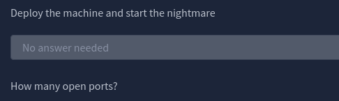
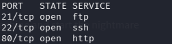
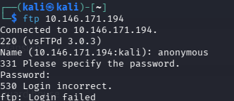
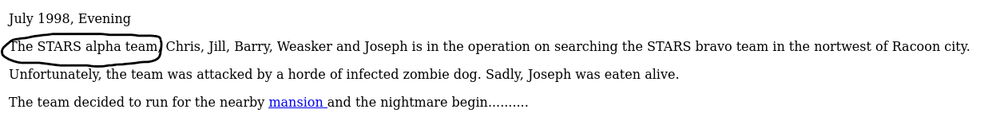
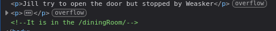
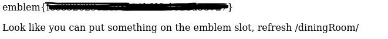
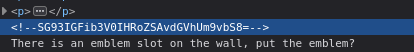
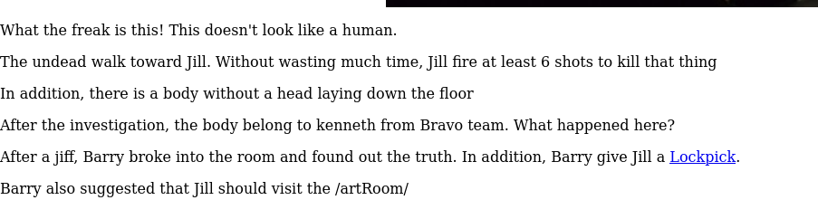
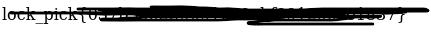
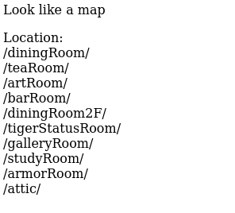

# Biohazard: https://tryhackme.com/room/biohazard

I'll first deploy my machine using openvpn for the first question. The second question ask how many open ports there are

To find out how many ports there we can use Nmap to discover any open ports

nmap (ip address)

Using nmap shows me three open port

The next question ask us what the team name in operation is. To find out more I'll investigate the open ports. Starting with ftp

Since I don't have any info on ftp I'll just try anonymous first to see if the server is public. Doing anonymous however gives me a failed login. I think I'll come back to it later

I'll try HTTP next since I don't have any credentials for ssh. Entering the website I find the name of the team which answers the third question. 

The first flag I need to find is the emblem flag

In the website is a redirect link that sends me to a subdirectory of the domain called mansion. Entering the mansion leades to no more redirects, so I inspect elements on the page to find any clues. Inside of inspect elements is another subdirectory to diningroom

In the diningroom directory is another redirect. This redirect leads directly to the emblem flag.

the emblem page also says to go back and refresh the diningroom page.  refreshing the page adds a prompt that lets me add a flag. placing the emblem flag back into the input does nothing. maybe we can come back to this later with a different flag?

Since none of the pages lead anywhere else, I will inspect elements to find any more clues

on inspect reveals some code in the diningroom

since I don't know what it is, I will put it into google to see what i can find about it.

pasting this code into gemeni tells me that it is a base64 encoded string, but that it translate to /teaRoom/ which is most likely subdirectory of the domain.

and it is!

going back to the question the flag we're looking for is the lock pick flag. i'll first try pressing the redirect link in the teaRoom

This ends up revealing the lockpick flag

since inspect element doesn't reveal anything else, i will continue onto the next the subdirectory which is artRoom

Inside of artRoom shows another link that redirects to a html file of a map with a list of subdirectories

I've already been to the first three rooms in the list, so I'll start making my way down the list starting with barRoom

Inside of the barRoom ask for the lockpick flag

## in progress