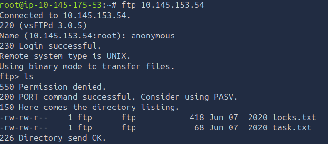
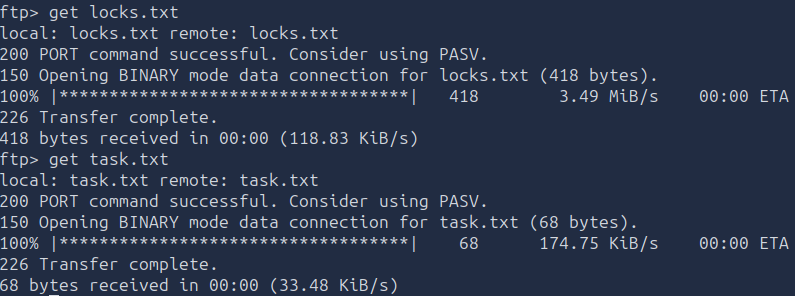
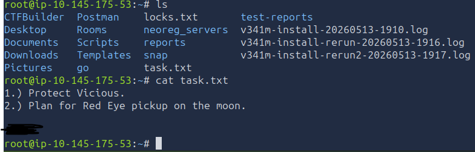
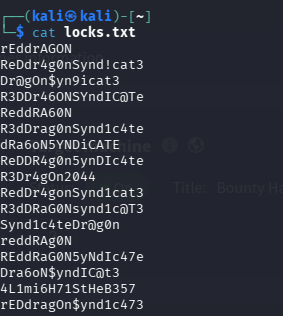
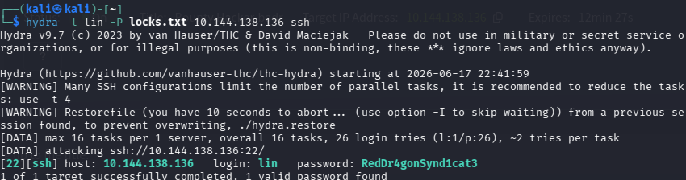
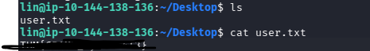
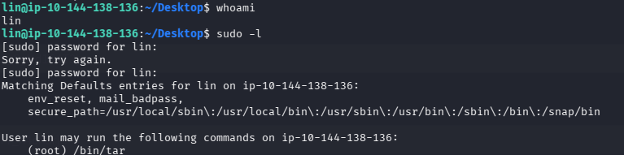
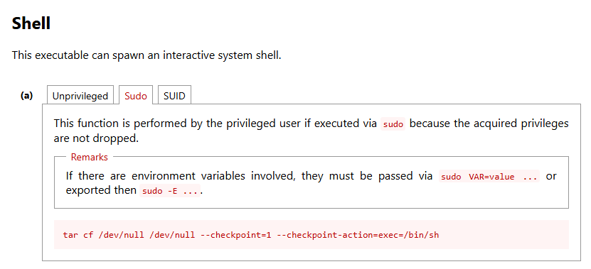
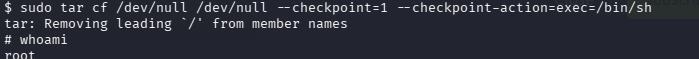
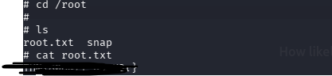

# Bounty Hacker 

[Bounty Hacker](https://tryhackme.com/room/cowboyhacker) is an easy boot2root involving enumeration, brute-forcing, and privilage escalation.

### Table of contents:
* [Deploy Machine](#deploy-machine)
* [Enumeration](#enumeration)
    * [Port Scanning](#port-scanning)
    * [FTP Enumeration](#ftp-enumeration)
* [SSH Bruteforce](#ssh-bruteforce)
* [Privilage Escalation](#privilage-escalation)
* [Reflection](#reflection)
## Deploy Machine
First questions ask us to deploy both the attack machine and lab machine before starting the lab. In this lab I will be using the attackbox provided by tryhackme.

## Enumeration

### Port Scanning
Second questions has us find open ports on the machine. Network ports are endpoints for software program and network services. To find the open ports we will use Nmap which is a reconnaissance tools used to scan a user's ip for ports.

nmap [ip address]

From the scan we're able to find three open ports.

### FTP Enumeration

Let's open FTP to see what we can find.

``FTP  [ip address]``

Logging in through FTP it seems that there is no credentials needed and that you can login in anoymously which allows us to access the public data on FTP. Opening the directory we can find two files that we can then download onto our machine.

Looking back at the third question it ask who wrote the task list. When we open up the task list we find out who wrote the task list inside of the text.

We're also given another file called locks.txt which contains what i presume a list of all the different passwords we can possibly try

## SSH Bruteforce
Now that we have a username we can try bruteforcinng the ssh using the locktxt we were given. This also answer the next question on what service we can bruteforce. to bruteforce the ssh we will use hydra 

``hydra -l lin -P locks.txt <target-ip> ssh``

bruteforcing the ssh with the given data gives us a successful login to the ssh

Inside of lin's SSH she has one file that is the user flag

## Privilage Escalation
Now that we have the user flag we need to figure out a way to escalate to root privilage so we can find root flag. The first thing i would do would be to see what privileges lin has on her SSH. so i would do: 

``sudo -l``

This command tell us what root privileges lin has

It looks likes lin has some sudo privileage for tar so I'll use a website called GTFObin that gives a list of different executable that bypass security restrictions.

I'll then paste this executable into lin's ssh. Doing this successfully gives me root 

We can then navigate to the root files where we we can find the root flag 

## Reflection

1. The key tools used in this TryHackMe was:
    1. Nmap
    2. Hydra
    3. GTFOBin
2. The key lesson learned from this TryHackMe was:
    1. How to perform basic Nmap scans
    2. How to perform basic hydra attacks
    3. Command to find what sudo privilege a user has
    4. Learned about GTFOBins and how it's used to breach misconfigured systems

