# Brooklyn Nine Nine

[Brookyln Nine Nine](https://tryhackme.com/room/brooklynninenine) is a easy boot2root involving enumeration, stenography, SSH and media bruteforce, and privilege escalation.

### Table of contents:
* [HTTP Enumeration](#http-enumeration)
* [Media File Bruteforce](#media-file-bruteforce)
* [Port Scanning](#port-scanning)
* [FTP Enumeration](#ftp-enumeration)
* [SSH Bruteforce](#ssh-bruteforce)
* [Privilage Escalation](#privilege-escalation)
* [Reflection](#reflection)

## HTTP Enumeration
Investigating the website we find the thumbnail for brooklyn nine nine. When we inspect the element of the page,  we're given a hint that it's related to stenoagraphy. 

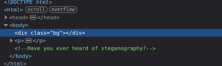

Stenography is the process of concealing data through harmless looking files. The first place we can analyze is the thumbnail file brooklyn.jpg from the target website

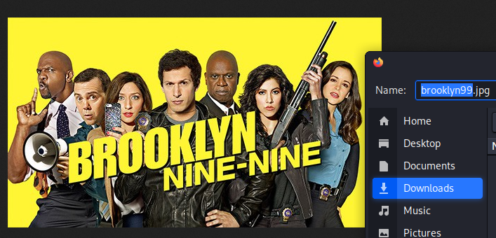

## Media File Bruteforce
I was unsure what tool to use to analyze and extract hidden data from an image so I searched up and found a tool called stegcracker which is a bruteforce tool for media files . 

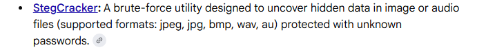

inside of kali linux are a assortment of different wordlist. for the jpg i will be using the rockyou wordlist which contains a large number of passwords. 

``stegcracker brooklyn99.jpg rockyou.txt``

using stegcracker reveals a hidden password for holt's SSH

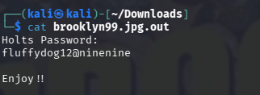

## Port Scanning
I initally forgot to perform a network scan using Nmap. 

``nmap (target-ip)``

The three open ports scanned are FTP, SSH, and HTTP which is the website. In order to open the SSH we need a username.  Let's look to see if FTP is anonymous.

``ftp (target-ip)``

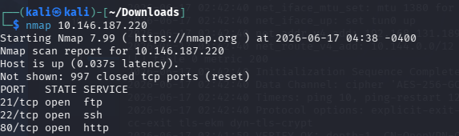

## FTP Enumeration
Looking into FTP, we are able to access the files without any credentials. Because FTP is set up as anonymous, the server doesn't require a account

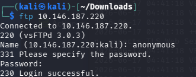

Inside FTP we find a file called ``note_to_jake.txt``

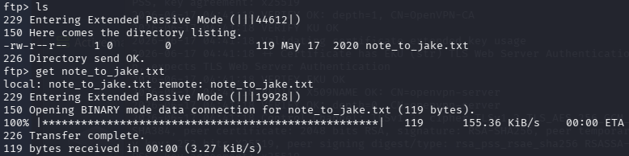

Inside of the txt file we find three names. Amy, Jake, and Holt.

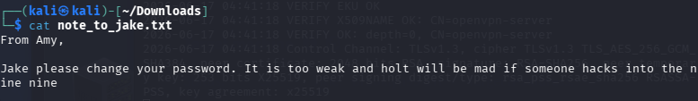

## SSH Bruteforce
Now that we have names, we can try plugging them into SSH. I'll first try Holt using the hidden password from the stenography

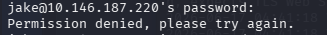

And just like that we have access into Holt's SSH. Inside of Holt's ssh she has a save file and a text file. Inside of the text file contains the user flag. 

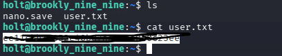

## Privilege Escalation
the second question ask us to find a the flag for the root user. somehow we need to escalate our level to root. first thing we can do is see what root commands we can access without a password

when we check what access we have, it shows us that we can run ``/usr/bin/less``.

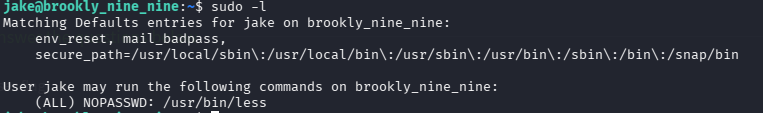

the first thing i did was searched up any vulnerabilties with this command line. one of the first website that popped up was GTFOBins which has a list of different executables that can bypass security restrictions from misconfigured systems. 

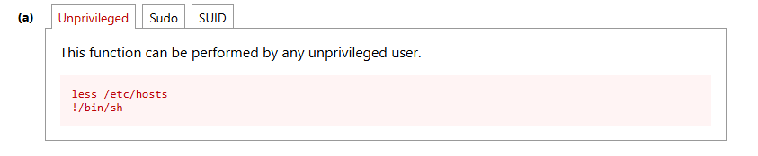

pasting these commands into jake's ssh successfully gives us root access. and we're finally able to find the root flag

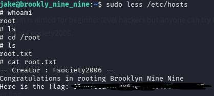

## Reflection
Tools used:

Nmap - port scanning

Stegcracker - media file bruteforce 

Hydra - network bruteforce

Doing this CTF I learned more about how to escalate to root. One of the commands that I found really useful was sudo -l which tells you what sudo actions you have access to. This allowed me to search for the vulnerability online giving me root access. I also learned a little bit about the interactive file viewer less and how to use it. The one important thing I learned from this practice CTF is how to strucuture my attack. Doing reconnisanse first then enumaration then exploitation.