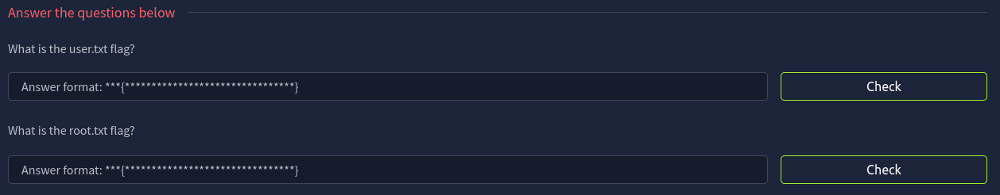
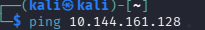

## Flatline: https://tryhackme.com/room/flatline

For this challenge we're asked to find the user flag and the root flag. As mentioned in the description of this room, the lab machine may run and carry out operations slower, so it's normal if your tools perform actions slower

We're not given any information, so let's start with a simple Nmap scan to see if we can find any open ports.

## ------------------------ Lab machine unreachable ------------------------

