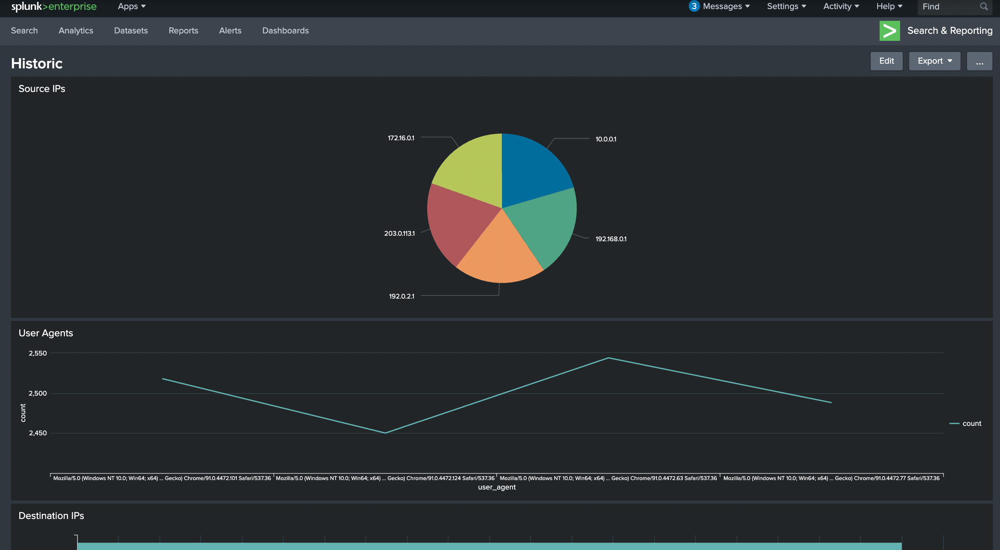

# Introduction To SIEM

[Introduction To SIEM](https://tryhackme.com/room/introtosiem) is an educational room that teaches the fundamentals of SIEMS and their functionality.

### Table of contents:
* [Task 1 - Introduction](#task-1---introduction)
* [Task 2 - Log Everywhere, Answers Nowhere](#task-2---log-everywhere-answers-nowhere)
* [Task 3 - Why SIEM?](#task-3-why-siem)
* [Task 4 - Log Sources and Ingestion](#task-4---log-sources-and-ingestion)
* [Task 5 - Alerting Process and Analysis](#task-5---alerting-process-and-analysis)
* [Task 6 - Lab Work](#task-6---lab-work)
* [Task 7 - Conclusion](#task-7---conclusion)
* [Reflection](#reflection)

## Task 1 - Introduction

SIEM stands for **security information and event management**. It is a core tool that soc analyst use to detect, analyze, and respond to security threat.

## Task 2 - Log Everywhere, Answers Nowhere

Devices constantly generate new logs of activites which makes easy to identify malcious activity or troubleshoot issues. There are two types of logs. **Host centric logs** are all activites done within or relation to the user. This could a user authentication or a device accessing files. **Network centric logs** are all activities done by communicating with other devices or accessing a website. This could be webtraffic or an SSH connection. 

Even though the logs may look simple to track, there a few issues that make it difficult to track and analyze:
* Since there are so many devices in a company network it becomes difficult and ineffecient to track all activity and analyze
* Log are not centralized and  you may have to connection to the log sources like SSH or FTP to analyze it
* Humans cannot read faster than what devices can create logs. People will miss important logs in between analysis
* Logs come in different format, making it difficult for humans to recognize quickly
## Task 3 Why SIEM?

Because of the various issues and complication of logs, SIEM is a handy solution that collect different types of log, format them, correlate them, and detect malicious activites

Features of SIEM:
* Collects logs from different sources and centralize them through lightweight agent or APIs
* Logs can be broken down into more specific category(parsing) and logs can be converted and formatted in one consistent form(normalization)
* SIEMS can also correlate logs of different sources so you don't spend time looking through individual logs
* SIEMS come with default rules to detect malicious activites however analyst can add new rules based on future detection
* After logs are normalized they are ingested(transfered) into a visual dashboard for easy analysis. The dashboards are customizable for different info such as failed login attempts, rules trigger, or top domain visited.

An example provided below is from splunk enterprise

## Task 4 - Log Sources and Ingestion

## Task 5 - Alerting Process and Analysis
## Task 6 - Lab Work
## Task 7 - Conclusion
## Reflection
