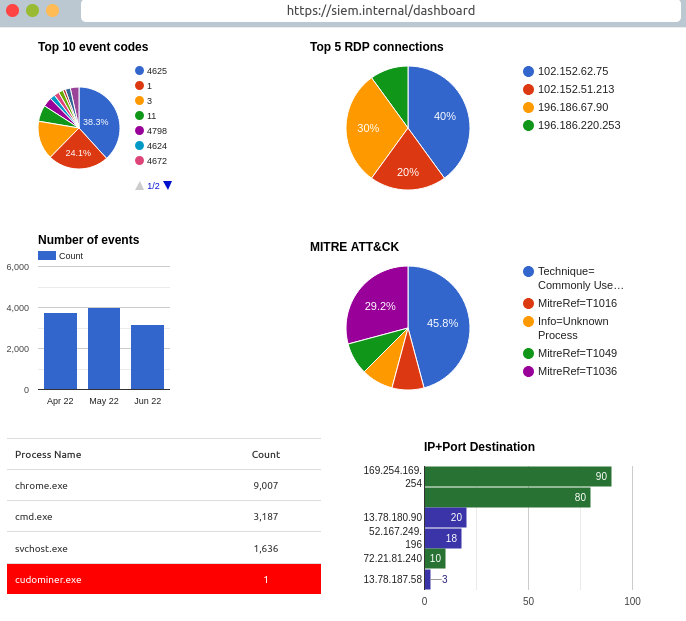
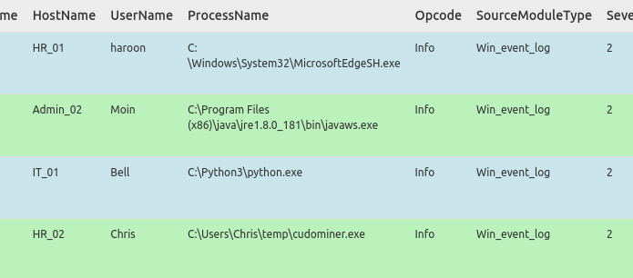
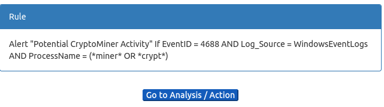

# Introduction To SIEM

[Introduction To SIEM](https://tryhackme.com/room/introtosiem) is an educational room that teaches the fundamentals of SIEMS and their functionality.

### Table of contents:
* [Task 1 - Introduction](#task-1---introduction)
* [Task 2 - Log Everywhere, Answers Nowhere](#task-2---log-everywhere-answers-nowhere)
* [Task 3 - Why SIEM?](#task-3-why-siem)
* [Task 4 - Log Sources and Ingestion](#task-4---log-sources-and-ingestion)
* [Task 5 - Alerting Process and Analysis](#task-5---alerting-process-and-analysis)
* [Task 6 - Lab Work](#task-6---lab-work)
* [Reflection](#reflection)

## Task 1 - Introduction

SIEM stands for **security information and event management**. It is a core tool that soc analyst use to detect, analyze, and respond to security threat.

## Task 2 - Log Everywhere, Answers Nowhere

Devices constantly generate new logs of activites which makes easy to identify malcious activity or troubleshoot issues. There are two types of logs. **Host centric logs** are all activites done within or relation to the user. This could a user authentication or a device accessing files. **Network centric logs** are all activities done by communicating with other devices or accessing a website. This could be webtraffic or an SSH connection. 

Even though the logs may look simple to track, there a few issues that make it difficult to track and analyze:
* Since there are so many devices in a company network it becomes difficult and ineffecient to track all activity and analyze
* Log are not centralized and  you may have to connection to the log sources like SSH or FTP to analyze it
* Humans cannot read faster than what devices can create logs. People will miss important logs in between analysis
* Logs come in different format, making it difficult for humans to recognize quickly
## Task 3 Why SIEM?

Because of the various issues and complication of logs, SIEM is a handy solution that collect different types of log, format them, correlate them, and detect malicious activites

Features of SIEM:
* Collects logs from different sources and centralize them through lightweight agent or APIs
* Logs can be broken down into more specific category(parsing) and logs can be converted and formatted in one consistent form(normalization)
* SIEMS can also correlate logs of different sources so you don't spend time looking through individual logs
* SIEMS come with default rules to detect malicious activites however analyst can add new rules based on future detection
* After logs are normalized they are ingested(transfered) into a visual dashboard for easy analysis. The dashboards are customizable for different info such as failed login attempts, rules trigger, or top domain visited.

An example provided below is from splunk enterprise

## Task 4 - Log Sources and Ingestion
* Windows keeps all of its logs that can be viewed on the event viewer and assigns a unique id to each log.

* Linux stores all of its logs in the ``/var/log`` subdirectory

Each SIEM has its own ways of injesting data, some common ways are:
* Splunk uses a lightweight software tool(fowarder) that captures and sends logs to the SIEM server
* Syslog which is a protocol that is used to carry logs and send them to centralized destinations
* manually uploading the logs for analysis
* port fowarding which allows siems to listen to ports 

## Task 5 - Alerting Process and Analysis
One of the most important parts of a SIEM tool is it's detection rule. Some example of detection rules is if someone has multiple failed password attempts in 10 seconds or if a person plugs in a usb(per company policy) a alert will go off.

An example provided by the room discussed how detection rules are created. One example is when a attack tries to delete a logs a unique event ID 104 is logged. When this happens we can create a rule that states ``If a log source is WinEventLog and Event ID 104 then Trigger an alert - Event log cleared``

Analyst spend most of their time in the SIEM dashboard. When an alert happens analyst check what conditions were met and if it is a false or true positive.If it is a false positive analyst will tune the rule so it doesn't happen again.
## Task 6 - Lab Work

After clicking on the Start Suspicious Activity button, which process caused the alert?

* Proceeding with the first question, the first process that causes alert is ``cudominer.exe``

Find the event that caused the alert and identify the user responsible for the process execution.

* Examining the process futher through dashboard shows that the user responsible for the process is ``Chris``

What is the hostname of the suspect user?

* The host name is ``HR_02``

Examine the rule and the suspicious process; which term matched the rule that caused the alert?

* The keyword miner from the process triggered the rule

Which option best represents the event? Choose from the following:

- False Positive

- True Positive

* This would be ``true positive`` because user are not normally supposed to be mining crypto on company devices.

## Reflection

Before doing this room, I didn’t know what SIEM was, let alone what it stood for. SIEM, which stands for Security Information and Event Management, is a security tool used to ingest and aggregate massive amounts of logs into one detailed dashboard. Within the dashboard, analysts can create detection rules to monitor millions of logs and identify potential security threats. The main purpose of a SIEM is to make it easier for analysts to focus on the most important parts of their job rather than manually analyzing millions of logs at a time.

Now that I've finished this room, I'm excited to experiment and create a project involving a SIEM in order to recreate and analyze logs like a real SOC analyst.