# RootMe

[RootMe](https://tryhackme.com/room/rrootme) - description later

### Table of contents:
* [Deploy Machine](#Deploy-Machine)
    * [OpenVPN](#openvpn)
* [Enumeration](#enumeration)
    * [Port Scanning](#port-scanning)
    * [SSH Enumerartion](#ssh-enumeration)
    * [Directory Enumeration](#directory-enumeration)
    * [HTTP Enumeration](#http-enumeration)
* [Reverse Shell](#reverse-shell)
* [Privilege Escalation](#privilege-escalation)

## Deploy Machine

### OpenVPN

For this room, I will be connecting using OpenVPN. You can find the setup guide on the tryhackme settings

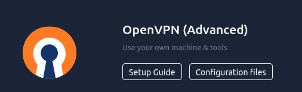

To properly setup the VPN, to connect to the target machine, you will need both OpenVPN and the configuration files provided in the setup guide

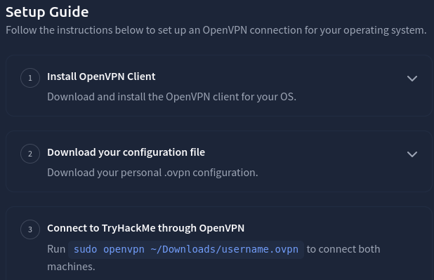

If you're on a linux machine all you need to do now is go onto the terminal and locate the configuration file and run  `sudo openvpn [file location]`

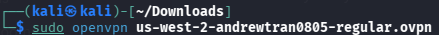

Now you're ready to start working on the room!

## Enumeration
### Port Scanning

We first need to scan the machine, and we can do that using Nmap.

`nmap [ip address]`

From the Nmap scan there are 2 open ports: 22(SSH) and 80(HTTP)

To find out what version of Apache is running, we can add the parameter `-sV` which stands for service version. This can tell us what version the ports are running on. And from the new Nmap scan the appache version is 2.4.41

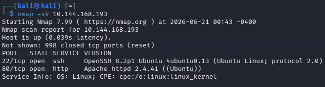

### SSH Enumeration
Port 22 is the SSH, to login into a ssh we need a username, hostname(website/ip), and password

``ssh username@hostname``

``password:``

However since we have no credential we will have to look else where before we can start getting into the SSH.
### Directory Enumeration
Before we start looking at port 80(HTTP), we need to conduct a directory enumeration via GoBuster as asked by the room. Since I've never touched GoBuster I'll do a quick search on the basic formatting.

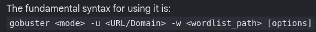

Since I'm using Kali Linux, I will be using the wordlist provided, however you can do a quick google search for directry files to use for GoBuster.

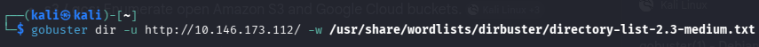

After just a few seconds, we successfully found 4 subdirectories: upload, css, js, and panel.

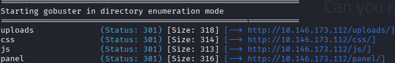

### HTTP Enumeration
Going through each subdirectory, the only one that looks weird is panel. From the subdirectory it looks custom-made which could provide clues on what to do next.

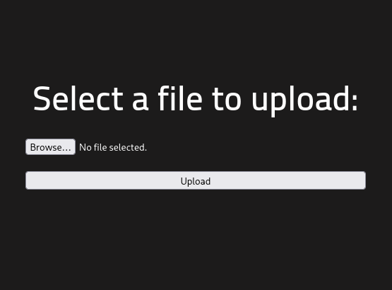

If I try pressing the upload button is presents a text in spanish which translates to "Error sending the file". Inspecting the element reveals no hints or clues that gives of us a hand. However, I realized that the main page shows the ssh which is ``root@rootme``

##  Reverse Shell
Going back to the room, it asks us to find a form to upload and get a reverse shell. Since I'm unsure about what form to try first I'll use the hint provided by the room. The hint says to search for php reverse shell.  The first result shows a github reposit  for a php reverse shell: [pentestmonkey](https://github.com/pentestmonkey/php-reverse-shell)

The PHP file has two parameters that you need to change to use it

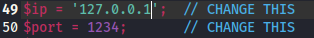

Both the IP and port be will match what your attacking machine will be doing. To find your attacker machine's ip a simple command such as ``ifconfig`` will show you all running network interfaces. A simple reminder that tun0 is the VPN interface and eth0 is your ethernet.

Uploading the .php file gives us a error that says "PHP is not allowed!". This could mean that the server has a filter that prevents PHP files.

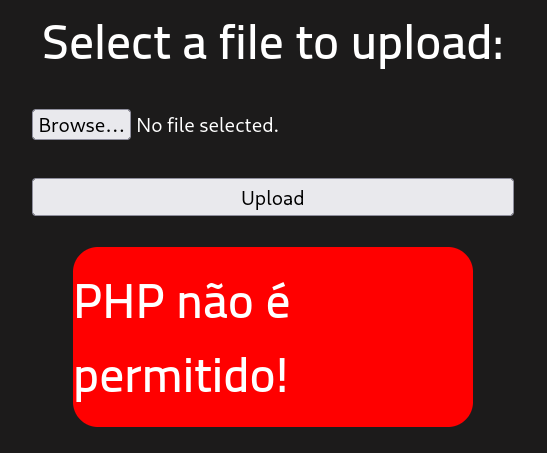

I decided to search up for different php file extensions and decided to try PHHTML because it allows both PHP and HTML which might get pass the filtering system. And it turns out it does works!

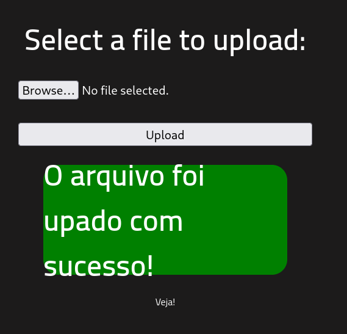

Now that we've successfully uploaded the phtml file we can need to find a way to connect to the shell. Doing a quick google search shows that the tool Netcat can be used to connect to the shell. Doing a quick search on formatting shows us a basic format to use. The l says to listen for connections, v stands for verbose which speeds up the process, and p stands for port which tells which port to listen to.

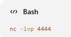

After setting up netcat we now need a way to active the reverse shell. One way we can do that is by heading to the /upload/ subdirectiory where we can activate the PHTML file. And just like that we're inside machine

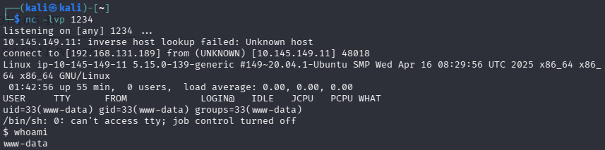

Now to find the user file we can use the ``find`` command

The specific command I will run is: ``find / -type f -name "user.txt"`` 

The / will start from the root directory and will search for a file type with the name user.txt. Doing this however gives us results with errors. 

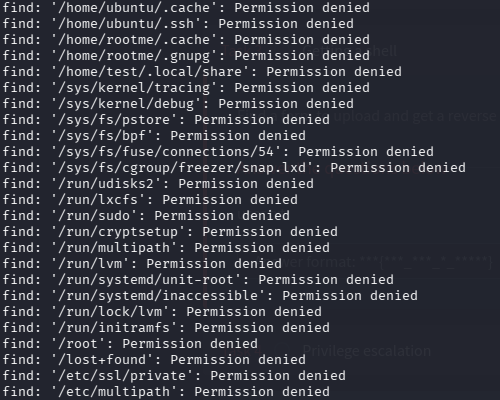

To minimize this I found an extra parameter  that removes errors ``2>/dev/null``. Doing this allows us find the results.

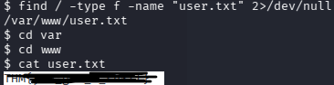

## Privilege Escalation
Now that we're inside of the shell we need to find a way to escalate to root privilege. Using the hint, it says that we can look for the key file by using `` find / -user root -perm /4000``. Doing this presents with a large number of errors, so we'll do the same thing again by adding ``2>/dev/null`` to remove the errors.

There was a lot of different SUID executables that the user had access to, so I did a quick search for what the answer was because I was stuck on it for a while. The weird SUID file that they mentioned was python2.7, which makes sense because it allows users to execute code.

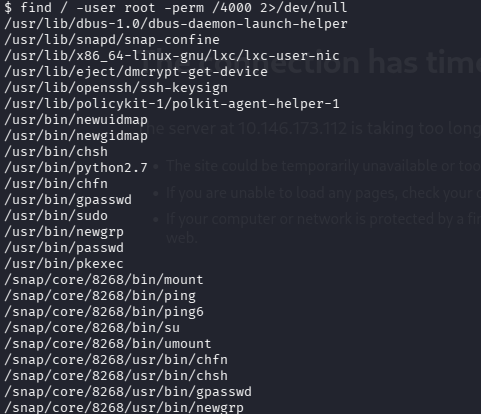

Additionally I found out from the walkthrough that you can do ``ls -la <file>`` which tells you who is the group owner and file owner of the file. This is useful to know when you are trying to find which files are owned by root and have special permissions such as SUID. 

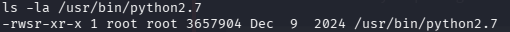

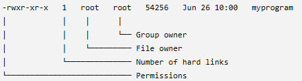

Now that we know which SUID is vulnerable we can look on GTFOBin for the executable. And just like that we now have root access.

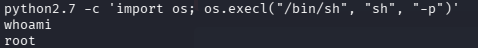

Now that we have root we can just navigate to the root directory and find the final flag. And just like that we've completed the room!

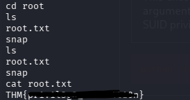

## Reflection