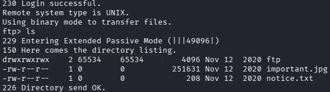
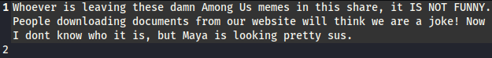
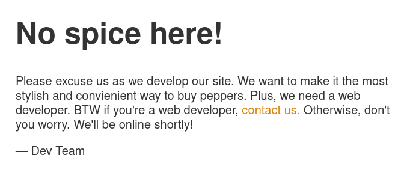
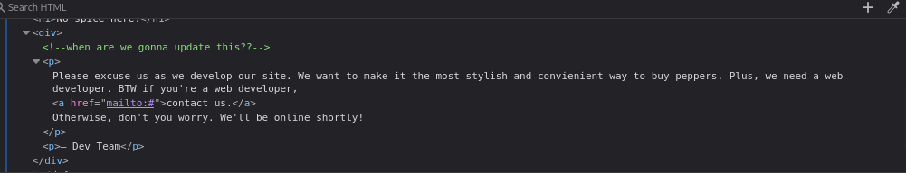
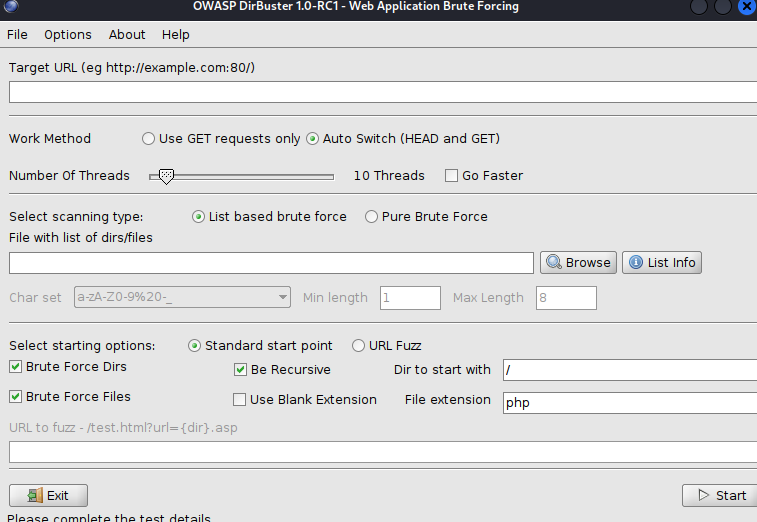
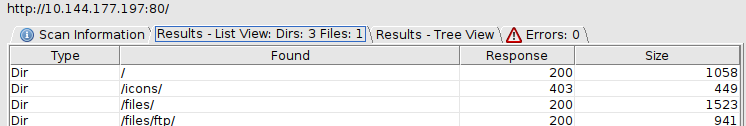

# Startup

[Startup](https://tryhackme.com/room/startup) is an easy boot2root involving 

### Table of contents:

## Context
The Spice Hunt company don't trust their own developers and have asked us 
to gain access into root through their machine to find vulnerabilites

## Enuermation

### Port Scanning

Let's start with a simple port scan to see what we have access to. Performing a simple nmap scan gives us access to: FTP(21), SSH(22), and HTTP(80)

### FTP Enumeration

I'll first check FTP to see if the server is public and can be accessed annonymously. Already our first vulnerbility is having public access to FTP and access to two company files. We can download these two files using ``get[filename]``

The first file ``important.jpg`` turns out to be a meme

When we view the second file ``notice.txt`` it reveals that someone in the company doesn't like the meme and that the person who sent it could've been a person named Maya. We will keep that in mind for later

### HTTP Enumeration

Let's head over to the website to see if we can gather any more information. Looking through the page of the website shows very little except for a contact link

Inside of inspect elements doesn't show hints or clues either

### Directory Enumeration

Since there's no clues inside of the HTML website maybe we can find subdirecties that developers are still working on. For this we can use the tool Dirbuster provided by Kali Linux. Similar to Gobuster, Dirbuster is also a bruteforce that uses a wordlist, however the tool is served in a GUI for ease of use.

Immediatly dirbuster is able to retrieve four subdirectories however it seems these subdirectories serve the same files we found in ftp. 

### SSH Bruteforce

My next best guess would have to be bruteforcing SSH