# Startup

[Startup](https://tryhackme.com/room/startup) is an easy boot2root involving 

### Table of contents:

## Context
The Spice Hunt company don't trust their own developers and have asked us 
to gain access into root through their machine to find vulnerabilites.

## Enuermation

### Port Scanning

Let's start with a simple port scan to see what we have access to. Performing a simple nmap scan gives us access to: FTP(21), SSH(22), and HTTP(80)

### FTP Enumeration

I'll first check FTP to see if the server is public and can be accessed annonymously. Already our first vulnerbility is having public access to FTP and access to two company files. We can download these two files using ``get[filename]``

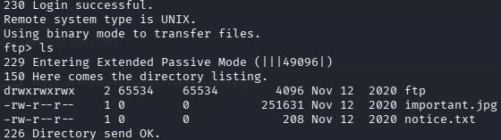

The first file ``important.jpg`` turns out to be a meme.

When we view the second file ``notice.txt`` it reveals that someone in the company doesn't like the meme and that the person who sent it could've been a person named Maya. We will keep that in mind for later

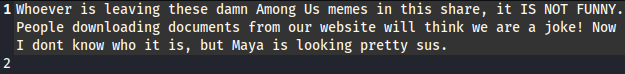

### HTTP Enumeration

Let's head over to the website to see if we can gather any more information. Looking through the page of the website shows very little except for a contact link

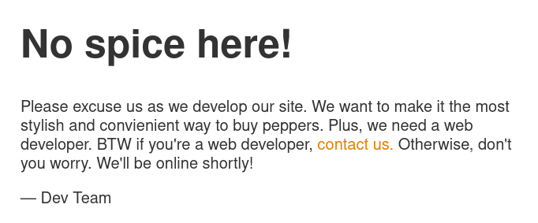

Inside of inspect elements doesn't show hints or clues either

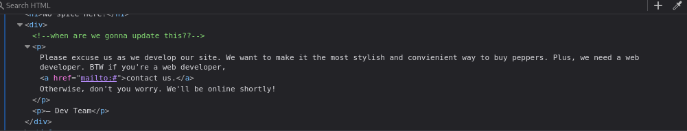

### Directory Enumeration

Since there's no clues inside of the HTML website maybe we can find subdirecties that developers are still working on. For this we can use the tool Dirbuster provided by Kali Linux. Similar to Gobuster, Dirbuster is also a bruteforce that uses a wordlist, however the tool is served in a GUI for ease of use.

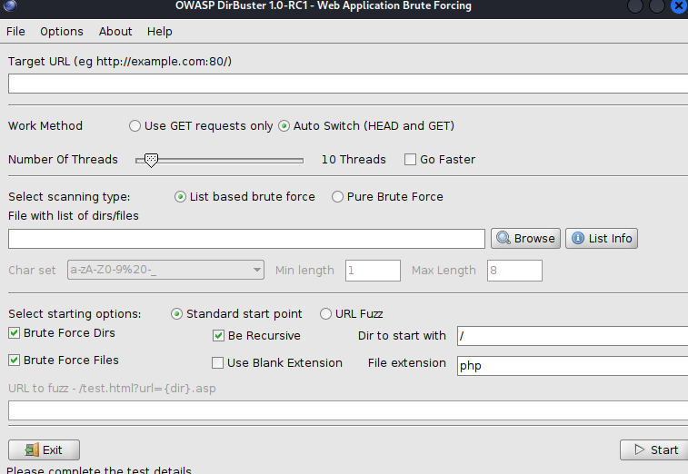

Immediatly dirbuster is able to retrieve four subdirectories however it seems these subdirectories serve the same files we found in ftp. 

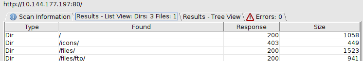

### Research

I found myself a little lost so, I did a little research. Looking at other walkthroughs I saw that you can create a reverse shell. A good pointer to find out whether you can do a reverse shell is by seeing what privilges you have access to.

When doing the Nmap scan earlier my Nmap output showed that FTP gave read,writee,and execute permission to all users.

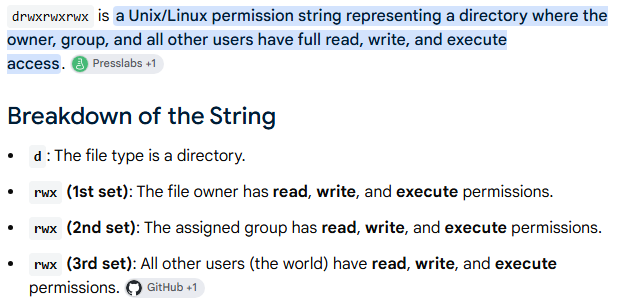

### Reverse Shell

To find out what reverse shell to use we need to first find out what webserver the website uses. We can do this by using ``-sV`` to get the service versions of the web server

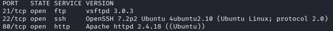

Usually if you can see what language it is using -sV. that would mean that the webserver is intentionally hiding it. However that shouldn't be any issue because the most common language used on apache is PHP.

Just like the rootme lab I'll also be using the php reverse shell: [pentestmonkey](https://github.com/pentestmonkey/php-reverse-shell)

Now to upload the PHP file since I have write access in FTP, I'll use the put method to add it in to the webserver.

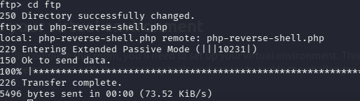

Now that we have reverse shell downloaded onto the server we can use ``nc`` to listen to oncoming connction from the port with the reverse shell

Just like that we're in the webserver
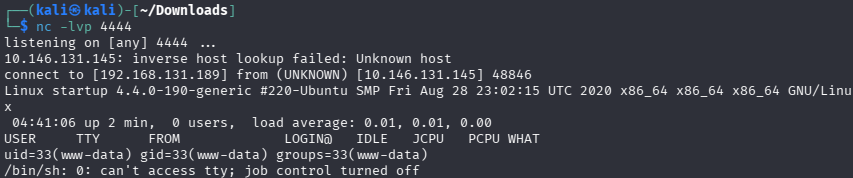

Looking through the directory I was able to idntify and find the answer to first question which asked what secret recipe was love

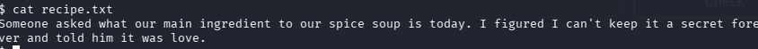

To find the flag for the second question I will do what I did for the previous lab which is to use the ``find`` command using this command ``find / -type f -name "user.txt"``. To remove any of permission denied messages I will also use this command ``2>/dev/null``

### Reflection
In this lab, I learned about the different vulnerabilties that can be discovered while using Nmap. With the help of youtube tutorials, the three key things to look for is versions types, permission, and open ports.

In this lab finding out which permission was key to getting access to user. One thing to note from this lab in order to figure out what reverse shell you need, you would have to know the webserver and language the machine is on.  